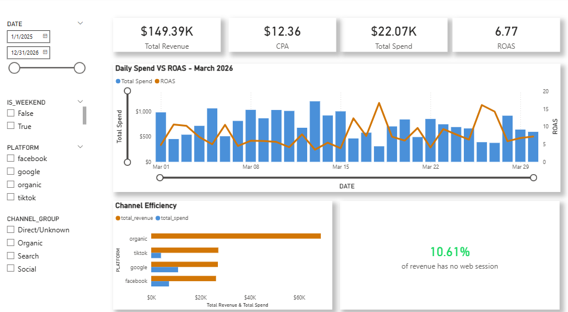

🚀 Marketing Attribution ELT Project

**📊 Project Overview**

This project demonstrates an end-to-end ELT pipeline transforming raw marketing and sales data into an executive-ready dashboard. The goal was to solve complex Marketing Attribution challenges—specifically identifying "leakage" where orders were not being correctly mapped to their marketing sources.

**🏗️ Data Architecture (Star Schema)**

The transformation layer (dbt) follows a modular architecture moving from Bronze (Raw) to Gold (Production-ready).

Fact Table: fct_daily_performance — Tracks Clicks, Spend, Orders, and Revenue by day and campaign.

Dimension Tables: * dim_campaigns: Mapping of Campaign IDs to Channels and Platforms.

dim_dates: A master calendar for Time Intelligence reporting.

**🛠️ Key Challenges & Solutions**

** The "Orphan Order" Problem (UNATTRIBUTED)**

During the modeling phase, I identified a significant volume of orders that lacked tracking parameters.

The Problem: These orders showed up as (Blank) in the dashboard, making the data look incomplete.

The Solution: Implemented a COALESCE logic in the Silver layer to catch nulls and manually injected these "Identity Rows" into the dim_campaigns model using a UNION ALL approach. This ensured 100% referential integrity.

**Standardizing Organic Traffic**

Raw data often labels organic traffic as none. I transformed this into a professional "Organic Search" category to improve stakeholder readability.

**📈 Dashboard Insights**

The final Power BI dashboard provides a clear breakdown of:

ROAS (Return on Ad Spend) across Facebook, Google, and TikTok.

Customer Acquisition Cost (CPA) trends.

Volume vs. Value: Comparing high-volume Organic traffic against high-value Paid traffic.

🚀 How to Run

Clone the repo: git clone <https://github.com/bilalrizvi21/marketing-attribution-elt-project>

Install dependencies: dbt deps

Configure Profiles: Ensure your profiles.yml is set up with Snowflake credentials.

Run Pipeline: dbt build

Configure Profiles: Ensure your profiles.yml is set up with Snowflake credentials.

Run Pipeline: dbt build
